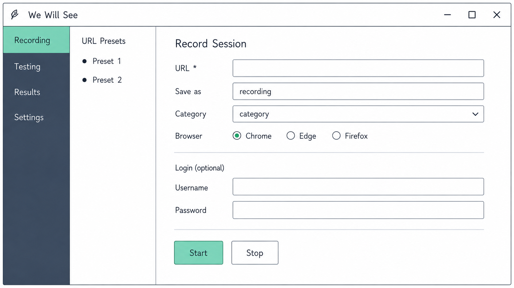
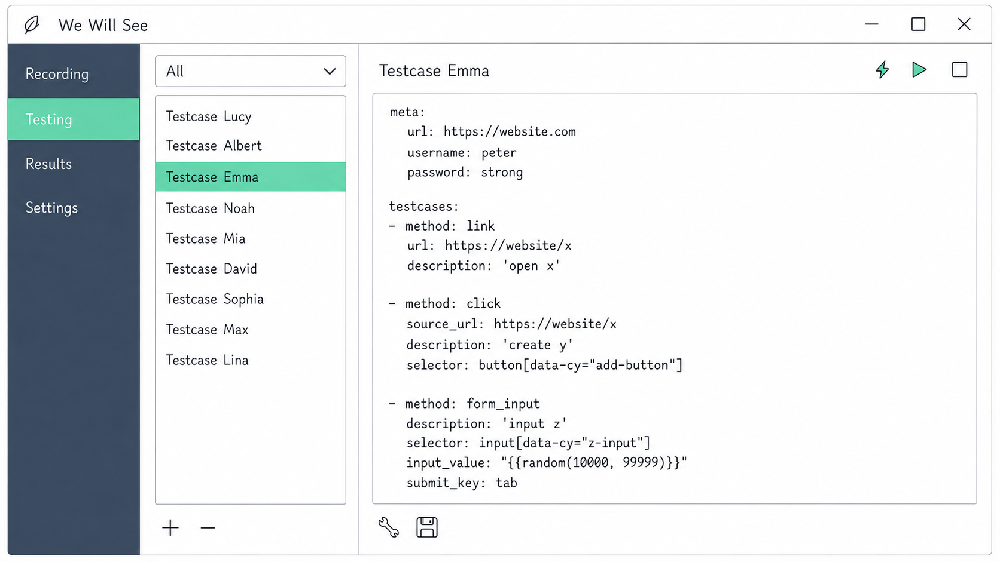
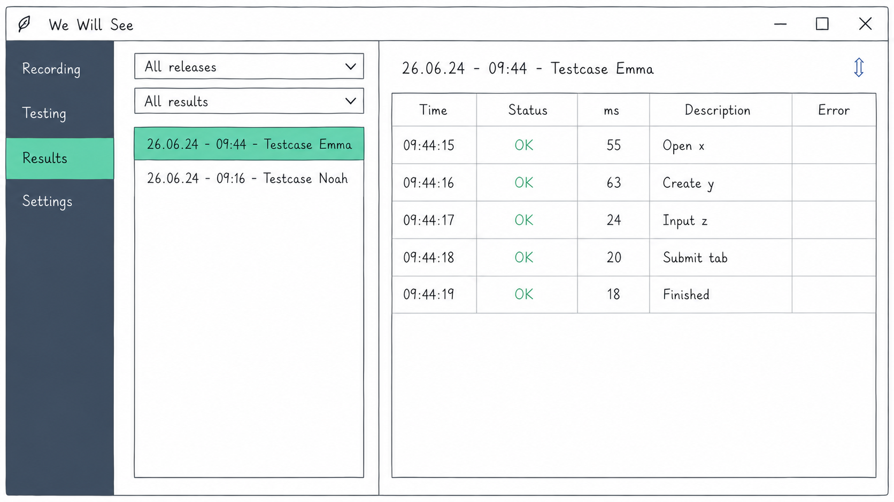
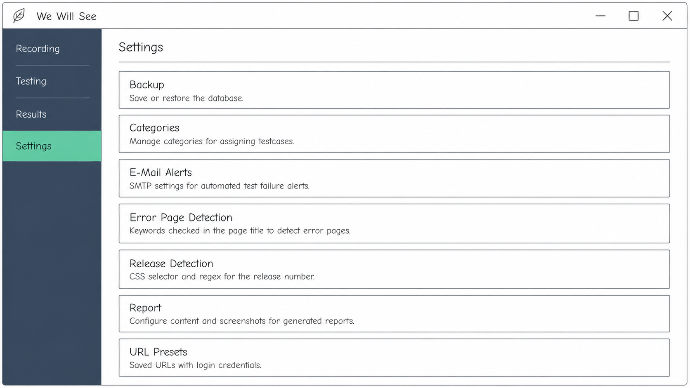

# We Will See

Python-based test automation for web applications.

## Purpose
- Continuously and automatically check production using navigation scripts. 
- Catch regressions early by automatically testing new releases on the test environment with data entry.

## Features

- Recording: capture test cases from a live browser session, saved automatically as YAML.
- GUI execution: run tests visually with a browser window.
- CLI execution: run tests headless for server-side automation.
- Scheduling: execute automated test cases on a schedule with email alerts on failure.
- URL Presets: save URLs with credentials for quick recording.
- Dynamic variables: use date expressions and random number ranges in any input field, resolved at runtime.
- Matrix runs: run the same test case with multiple variable combinations, optionally in parallel.
- Stored values: capture a value from the page and reference it as a variable in later steps.
- Optional steps: mark individual steps as optional so a failure skips the step without failing the whole run.
- Error assertions: verify that an action correctly produces an error.
- Per-testcase settings: configure step timeout, run timeout, stop-on-error, parallel execution, and screenshot-on-error for each test case.
- Release detection: automatically read and record the application release number.
- Result reports: create a report, optionally filtered to errors only and including screenshots.

## Getting Started

- Run directly: `py main.py`
- Build a standalone Windows executable: `pyinstaller app.spec`
- Automation: test cases marked as automated can be scheduled for server-side execution: `py main.py --automated`

## License  - method: foreach
    var: product_nos
    description: Add products
    steps:
      - method: form_input
        selector: input[name="product_no"]
        input_value: "{{product_nos}}"
        submit_key: enter
        description: Add product position

- Licensed under the [PolyForm Noncommercial License 1.0.0](LICENSE).
- Free use, modification, and distribution for non-commercial purposes only.

## Mockups







### Example

```yaml
meta:
  url: https://app.example.com
  username: admin
  password: secret
  matrix:
    product_nos:
      - [100, 200]

testcases:
  - method: link
    url: https://example.com/orders
    description: Open orders list

  - method: click
    selector: button.new-order
    description: Click new order button

  - method: link
    url: https://example.com/orders/new
    description: Assert URL is new order form

  - method: click
    selector: select[name="address"] option:first-of-type
    description: Select first address

  - method: form_input
    selector: input[name="date"]
    input_value: "{{today}}"
    description: Enter today's date

  - method: foreach
    var: product_nos
    description: Add products
    steps:
      - method: form_input
        selector: input[name="product_no"]
        input_value: "{{product_nos}}"
        description: Add product position
        submit_key: enter

  - method: click
    selector: button.create-order
    description: Click create order button

  - method: read_value
    selector: .order-number
    store_as: orderNr
    description: Read order number
```